```mermaid
flowchart TB
    subgraph upstream["Dependants (5)"]
        P1["<b>📦&nbsp;WarriorsGuild.csproj</b><br/><small>net6.0</small>"]
        P2["<b>📦&nbsp;WarriorsGuild.Tests.csproj</b><br/><small>net6.0</small>"]
        P4["<b>📦&nbsp;WarriorsGuild.Crosses.csproj</b><br/><small>net6.0</small>"]
        P5["<b>📦&nbsp;WarriorsGuild.Rings.csproj</b><br/><small>net6.0</small>"]
        P6["<b>📦&nbsp;WarriorsGuild.Ranks.csproj</b><br/><small>net6.0</small>"]
        click P1 "#warriorsguildwarriorsguildcsproj"
        click P2 "#warriorsguildtestswarriorsguildtestscsproj"
        click P4 "#warriorsguildcrosseswarriorsguildcrossescsproj"
        click P5 "#warriorsguildringswarriorsguildringscsproj"
        click P6 "#warriorsguildrankswarriorsguildrankscsproj"
    end
    subgraph current["WarriorsGuild.Common.csproj"]
        MAIN["<b>📦&nbsp;WarriorsGuild.Common.csproj</b><br/><small>net6.0</small>"]
        click MAIN "#warriorsguildcommonwarriorsguildcommoncsproj"
    end
    P1 --> MAIN
    P2 --> MAIN
    P4 --> MAIN
    P5 --> MAIN
    P6 --> MAIN

```

```mermaid
flowchart TB
    subgraph upstream["Dependants (2)"]
        P1["<b>📦&nbsp;WarriorsGuild.csproj</b><br/><small>net6.0</small>"]
        P2["<b>📦&nbsp;WarriorsGuild.Tests.csproj</b><br/><small>net6.0</small>"]
        click P1 "#warriorsguildwarriorsguildcsproj"
        click P2 "#warriorsguildtestswarriorsguildtestscsproj"
    end
    subgraph current["WarriorsGuild.Crosses.csproj"]
        MAIN["<b>📦&nbsp;WarriorsGuild.Crosses.csproj</b><br/><small>net6.0</small>"]
        click MAIN "#warriorsguildcrosseswarriorsguildcrossescsproj"
    end
    subgraph downstream["Dependencies (4"]
        P3["<b>📦&nbsp;WarriorsGuild.Data.csproj</b><br/><small>net6.0</small>"]
        P7["<b>📦&nbsp;WarriorsGuild.Common.csproj</b><br/><small>net6.0</small>"]
        P10["<b>📦&nbsp;WarriorsGuild.Email.csproj</b><br/><small>net6.0</small>"]
        P9["<b>📦&nbsp;WarriorsGuild.Storage.csproj</b><br/><small>net6.0</small>"]
        click P3 "#warriorsguilddatawarriorsguilddatacsproj"
        click P7 "#warriorsguildcommonwarriorsguildcommoncsproj"
        click P10 "#warriorsguildemailwarriorsguildemailcsproj"
        click P9 "#warriorsguildstoragewarriorsguildstoragecsproj"
    end
    P1 --> MAIN
    P2 --> MAIN
    MAIN --> P3
    MAIN --> P7
    MAIN --> P10
    MAIN --> P9

```

```mermaid
flowchart TB
    subgraph upstream["Dependants (6)"]
        P1["<b>📦&nbsp;WarriorsGuild.csproj</b><br/><small>net6.0</small>"]
        P2["<b>📦&nbsp;WarriorsGuild.Tests.csproj</b><br/><small>net6.0</small>"]
        P4["<b>📦&nbsp;WarriorsGuild.Crosses.csproj</b><br/><small>net6.0</small>"]
        P5["<b>📦&nbsp;WarriorsGuild.Rings.csproj</b><br/><small>net6.0</small>"]
        P6["<b>📦&nbsp;WarriorsGuild.Ranks.csproj</b><br/><small>net6.0</small>"]
        P11["<b>📦&nbsp;WarriorsGuild.Users.csproj</b><br/><small>net6.0</small>"]
        click P1 "#warriorsguildwarriorsguildcsproj"
        click P2 "#warriorsguildtestswarriorsguildtestscsproj"
        click P4 "#warriorsguildcrosseswarriorsguildcrossescsproj"
        click P5 "#warriorsguildringswarriorsguildringscsproj"
        click P6 "#warriorsguildrankswarriorsguildrankscsproj"
        click P11 "#warriorsguilduserswarriorsguilduserscsproj"
    end
    subgraph current["WarriorsGuild.Data.csproj"]
        MAIN["<b>📦&nbsp;WarriorsGuild.Data.csproj</b><br/><small>net6.0</small>"]
        click MAIN "#warriorsguilddatawarriorsguilddatacsproj"
    end
    P1 --> MAIN
    P2 --> MAIN
    P4 --> MAIN
    P5 --> MAIN
    P6 --> MAIN
    P11 --> MAIN

```

```mermaid
flowchart TB
    subgraph upstream["Dependants (5)"]
        P1["<b>📦&nbsp;WarriorsGuild.csproj</b><br/><small>net6.0</small>"]
        P2["<b>📦&nbsp;WarriorsGuild.Tests.csproj</b><br/><small>net6.0</small>"]
        P4["<b>📦&nbsp;WarriorsGuild.Crosses.csproj</b><br/><small>net6.0</small>"]
        P5["<b>📦&nbsp;WarriorsGuild.Rings.csproj</b><br/><small>net6.0</small>"]
        P6["<b>📦&nbsp;WarriorsGuild.Ranks.csproj</b><br/><small>net6.0</small>"]
        click P1 "#warriorsguildwarriorsguildcsproj"
        click P2 "#warriorsguildtestswarriorsguildtestscsproj"
        click P4 "#warriorsguildcrosseswarriorsguildcrossescsproj"
        click P5 "#warriorsguildringswarriorsguildringscsproj"
        click P6 "#warriorsguildrankswarriorsguildrankscsproj"
    end
    subgraph current["WarriorsGuild.Email.csproj"]
        MAIN["<b>📦&nbsp;WarriorsGuild.Email.csproj</b><br/><small>net6.0</small>"]
        click MAIN "#warriorsguildemailwarriorsguildemailcsproj"
    end
    P1 --> MAIN
    P2 --> MAIN
    P4 --> MAIN
    P5 --> MAIN
    P6 --> MAIN

```

```mermaid
flowchart TB
    subgraph upstream["Dependants (5)"]
        P1["<b>📦&nbsp;WarriorsGuild.csproj</b><br/><small>net6.0</small>"]
        P2["<b>📦&nbsp;WarriorsGuild.Tests.csproj</b><br/><small>net6.0</small>"]
        P5["<b>📦&nbsp;WarriorsGuild.Rings.csproj</b><br/><small>net6.0</small>"]
        P6["<b>📦&nbsp;WarriorsGuild.Ranks.csproj</b><br/><small>net6.0</small>"]
        P9["<b>📦&nbsp;WarriorsGuild.Storage.csproj</b><br/><small>net6.0</small>"]
        click P1 "#warriorsguildwarriorsguildcsproj"
        click P2 "#warriorsguildtestswarriorsguildtestscsproj"
        click P5 "#warriorsguildringswarriorsguildringscsproj"
        click P6 "#warriorsguildrankswarriorsguildrankscsproj"
        click P9 "#warriorsguildstoragewarriorsguildstoragecsproj"
    end
    subgraph current["WarriorsGuild.FileUpload.csproj"]
        MAIN["<b>📦&nbsp;WarriorsGuild.FileUpload.csproj</b><br/><small>net6.0</small>"]
        click MAIN "#warriorsguildfileuploadwarriorsguildfileuploadcsproj"
    end
    P1 --> MAIN
    P2 --> MAIN
    P5 --> MAIN
    P6 --> MAIN
    P9 --> MAIN

```

```mermaid
flowchart TB
    subgraph upstream["Dependants (2)"]
        P1["<b>📦&nbsp;WarriorsGuild.csproj</b><br/><small>net6.0</small>"]
        P2["<b>📦&nbsp;WarriorsGuild.Tests.csproj</b><br/><small>net6.0</small>"]
        click P1 "#warriorsguildwarriorsguildcsproj"
        click P2 "#warriorsguildtestswarriorsguildtestscsproj"
    end
    subgraph current["WarriorsGuild.Ranks.csproj"]
        MAIN["<b>📦&nbsp;WarriorsGuild.Ranks.csproj</b><br/><small>net6.0</small>"]
        click MAIN "#warriorsguildrankswarriorsguildrankscsproj"
    end
    subgraph downstream["Dependencies (6"]
        P3["<b>📦&nbsp;WarriorsGuild.Data.csproj</b><br/><small>net6.0</small>"]
        P11["<b>📦&nbsp;WarriorsGuild.Users.csproj</b><br/><small>net6.0</small>"]
        P8["<b>📦&nbsp;WarriorsGuild.FileUpload.csproj</b><br/><small>net6.0</small>"]
        P7["<b>📦&nbsp;WarriorsGuild.Common.csproj</b><br/><small>net6.0</small>"]
        P10["<b>📦&nbsp;WarriorsGuild.Email.csproj</b><br/><small>net6.0</small>"]
        P9["<b>📦&nbsp;WarriorsGuild.Storage.csproj</b><br/><small>net6.0</small>"]
        click P3 "#warriorsguilddatawarriorsguilddatacsproj"
        click P11 "#warriorsguilduserswarriorsguilduserscsproj"
        click P8 "#warriorsguildfileuploadwarriorsguildfileuploadcsproj"
        click P7 "#warriorsguildcommonwarriorsguildcommoncsproj"
        click P10 "#warriorsguildemailwarriorsguildemailcsproj"
        click P9 "#warriorsguildstoragewarriorsguildstoragecsproj"
    end
    P1 --> MAIN
    P2 --> MAIN
    MAIN --> P3
    MAIN --> P11
    MAIN --> P8
    MAIN --> P7
    MAIN --> P10
    MAIN --> P9

```

```mermaid
flowchart TB
    subgraph upstream["Dependants (5)"]
        P1["<b>📦&nbsp;WarriorsGuild.csproj</b><br/><small>net6.0</small>"]
        P2["<b>📦&nbsp;WarriorsGuild.Tests.csproj</b><br/><small>net6.0</small>"]
        P4["<b>📦&nbsp;WarriorsGuild.Crosses.csproj</b><br/><small>net6.0</small>"]
        P5["<b>📦&nbsp;WarriorsGuild.Rings.csproj</b><br/><small>net6.0</small>"]
        P6["<b>📦&nbsp;WarriorsGuild.Ranks.csproj</b><br/><small>net6.0</small>"]
        click P1 "#warriorsguildwarriorsguildcsproj"
        click P2 "#warriorsguildtestswarriorsguildtestscsproj"
        click P4 "#warriorsguildcrosseswarriorsguildcrossescsproj"
        click P5 "#warriorsguildringswarriorsguildringscsproj"
        click P6 "#warriorsguildrankswarriorsguildrankscsproj"
    end
    subgraph current["WarriorsGuild.Storage.csproj"]
        MAIN["<b>📦&nbsp;WarriorsGuild.Storage.csproj</b><br/><small>net6.0</small>"]
        click MAIN "#warriorsguildstoragewarriorsguildstoragecsproj"
    end
    subgraph downstream["Dependencies (1"]
        P8["<b>📦&nbsp;WarriorsGuild.FileUpload.csproj</b><br/><small>net6.0</small>"]
        click P8 "#warriorsguildfileuploadwarriorsguildfileuploadcsproj"
    end
    P1 --> MAIN
    P2 --> MAIN
    P4 --> MAIN
    P5 --> MAIN
    P6 --> MAIN
    MAIN --> P8

```

```mermaid
flowchart TB
    subgraph current["WarriorsGuild.Tests.csproj"]
        MAIN["<b>📦&nbsp;WarriorsGuild.Tests.csproj</b><br/><small>net6.0</small>"]
        click MAIN "#warriorsguildtestswarriorsguildtestscsproj"
    end
    subgraph downstream["Dependencies (10"]
        P6["<b>📦&nbsp;WarriorsGuild.Ranks.csproj</b><br/><small>net6.0</small>"]
        P3["<b>📦&nbsp;WarriorsGuild.Data.csproj</b><br/><small>net6.0</small>"]
        P11["<b>📦&nbsp;WarriorsGuild.Users.csproj</b><br/><small>net6.0</small>"]
        P8["<b>📦&nbsp;WarriorsGuild.FileUpload.csproj</b><br/><small>net6.0</small>"]
        P5["<b>📦&nbsp;WarriorsGuild.Rings.csproj</b><br/><small>net6.0</small>"]
        P4["<b>📦&nbsp;WarriorsGuild.Crosses.csproj</b><br/><small>net6.0</small>"]
        P1["<b>📦&nbsp;WarriorsGuild.csproj</b><br/><small>net6.0</small>"]
        P7["<b>📦&nbsp;WarriorsGuild.Common.csproj</b><br/><small>net6.0</small>"]
        P10["<b>📦&nbsp;WarriorsGuild.Email.csproj</b><br/><small>net6.0</small>"]
        P9["<b>📦&nbsp;WarriorsGuild.Storage.csproj</b><br/><small>net6.0</small>"]
        click P6 "#warriorsguildrankswarriorsguildrankscsproj"
        click P3 "#warriorsguilddatawarriorsguilddatacsproj"
        click P11 "#warriorsguilduserswarriorsguilduserscsproj"
        click P8 "#warriorsguildfileuploadwarriorsguildfileuploadcsproj"
        click P5 "#warriorsguildringswarriorsguildringscsproj"
        click P4 "#warriorsguildcrosseswarriorsguildcrossescsproj"
        click P1 "#warriorsguildwarriorsguildcsproj"
        click P7 "#warriorsguildcommonwarriorsguildcommoncsproj"
        click P10 "#warriorsguildemailwarriorsguildemailcsproj"
        click P9 "#warriorsguildstoragewarriorsguildstoragecsproj"
    end
    MAIN --> P6
    MAIN --> P3
    MAIN --> P11
    MAIN --> P8
    MAIN --> P5
    MAIN --> P4
    MAIN --> P1
    MAIN --> P7
    MAIN --> P10
    MAIN --> P9

```

```mermaid
flowchart TB
    subgraph upstream["Dependants (4)"]
        P1["<b>📦&nbsp;WarriorsGuild.csproj</b><br/><small>net6.0</small>"]
        P2["<b>📦&nbsp;WarriorsGuild.Tests.csproj</b><br/><small>net6.0</small>"]
        P5["<b>📦&nbsp;WarriorsGuild.Rings.csproj</b><br/><small>net6.0</small>"]
        P6["<b>📦&nbsp;WarriorsGuild.Ranks.csproj</b><br/><small>net6.0</small>"]
        click P1 "#warriorsguildwarriorsguildcsproj"
        click P2 "#warriorsguildtestswarriorsguildtestscsproj"
        click P5 "#warriorsguildringswarriorsguildringscsproj"
        click P6 "#warriorsguildrankswarriorsguildrankscsproj"
    end
    subgraph current["WarriorsGuild.Users.csproj"]
        MAIN["<b>📦&nbsp;WarriorsGuild.Users.csproj</b><br/><small>net6.0</small>"]
        click MAIN "#warriorsguilduserswarriorsguilduserscsproj"
    end
    subgraph downstream["Dependencies (1"]
        P3["<b>📦&nbsp;WarriorsGuild.Data.csproj</b><br/><small>net6.0</small>"]
        click P3 "#warriorsguilddatawarriorsguilddatacsproj"
    end
    P1 --> MAIN
    P2 --> MAIN
    P5 --> MAIN
    P6 --> MAIN
    MAIN --> P3

```

```mermaid
flowchart TB
    subgraph upstream["Dependants (1)"]
        P2["<b>📦&nbsp;WarriorsGuild.Tests.csproj</b><br/><small>net6.0</small>"]
        click P2 "#warriorsguildtestswarriorsguildtestscsproj"
    end
    subgraph current["WarriorsGuild.csproj"]
        MAIN["<b>📦&nbsp;WarriorsGuild.csproj</b><br/><small>net6.0</small>"]
        click MAIN "#warriorsguildwarriorsguildcsproj"
    end
    subgraph downstream["Dependencies (9"]
        P6["<b>📦&nbsp;WarriorsGuild.Ranks.csproj</b><br/><small>net6.0</small>"]
        P3["<b>📦&nbsp;WarriorsGuild.Data.csproj</b><br/><small>net6.0</small>"]
        P11["<b>📦&nbsp;WarriorsGuild.Users.csproj</b><br/><small>net6.0</small>"]
        P8["<b>📦&nbsp;WarriorsGuild.FileUpload.csproj</b><br/><small>net6.0</small>"]
        P5["<b>📦&nbsp;WarriorsGuild.Rings.csproj</b><br/><small>net6.0</small>"]
        P4["<b>📦&nbsp;WarriorsGuild.Crosses.csproj</b><br/><small>net6.0</small>"]
        P7["<b>📦&nbsp;WarriorsGuild.Common.csproj</b><br/><small>net6.0</small>"]
        P10["<b>📦&nbsp;WarriorsGuild.Email.csproj</b><br/><small>net6.0</small>"]
        P9["<b>📦&nbsp;WarriorsGuild.Storage.csproj</b><br/><small>net6.0</small>"]
        click P6 "#warriorsguildrankswarriorsguildrankscsproj"
        click P3 "#warriorsguilddatawarriorsguilddatacsproj"
        click P11 "#warriorsguilduserswarriorsguilduserscsproj"
        click P8 "#warriorsguildfileuploadwarriorsguildfileuploadcsproj"
        click P5 "#warriorsguildringswarriorsguildringscsproj"
        click P4 "#warriorsguildcrosseswarriorsguildcrossescsproj"
        click P7 "#warriorsguildcommonwarriorsguildcommoncsproj"
        click P10 "#warriorsguildemailwarriorsguildemailcsproj"
        click P9 "#warriorsguildstoragewarriorsguildstoragecsproj"
    end
    P2 --> MAIN
    MAIN --> P6
    MAIN --> P3
    MAIN --> P11
    MAIN --> P8
    MAIN --> P5
    MAIN --> P4
    MAIN --> P7
    MAIN --> P10
    MAIN --> P9

```

# Projects and dependencies analysis

This document provides a comprehensive overview of the projects and their dependencies in the context of upgrading to .NETCoreApp,Version=v10.0.

## Table of Contents

- [Executive Summary](#executive-Summary)
  - [Highlevel Metrics](#highlevel-metrics)
  - [Projects Compatibility](#projects-compatibility)
  - [Package Compatibility](#package-compatibility)
  - [API Compatibility](#api-compatibility)
- [Aggregate NuGet packages details](#aggregate-nuget-packages-details)
- [Top API Migration Challenges](#top-api-migration-challenges)
  - [Technologies and Features](#technologies-and-features)
  - [Most Frequent API Issues](#most-frequent-api-issues)
- [Projects Relationship Graph](#projects-relationship-graph)
- [Project Details](#project-details)

  - [WarriorsGuild.Common\WarriorsGuild.Common.csproj](#warriorsguildcommonwarriorsguildcommoncsproj)
  - [WarriorsGuild.Crosses\WarriorsGuild.Crosses.csproj](#warriorsguildcrosseswarriorsguildcrossescsproj)
  - [WarriorsGuild.Data\WarriorsGuild.Data.csproj](#warriorsguilddatawarriorsguilddatacsproj)
  - [WarriorsGuild.Email\WarriorsGuild.Email.csproj](#warriorsguildemailwarriorsguildemailcsproj)
  - [WarriorsGuild.FileUpload\WarriorsGuild.FileUpload.csproj](#warriorsguildfileuploadwarriorsguildfileuploadcsproj)
  - [WarriorsGuild.Ranks\WarriorsGuild.Ranks.csproj](#warriorsguildrankswarriorsguildrankscsproj)
  - [WarriorsGuild.Rings\WarriorsGuild.Rings.csproj](#warriorsguildringswarriorsguildringscsproj)
  - [WarriorsGuild.Storage\WarriorsGuild.Storage.csproj](#warriorsguildstoragewarriorsguildstoragecsproj)
  - [WarriorsGuild.Tests\WarriorsGuild.Tests.csproj](#warriorsguildtestswarriorsguildtestscsproj)
  - [WarriorsGuild.Users\WarriorsGuild.Users.csproj](#warriorsguilduserswarriorsguilduserscsproj)
  - [WarriorsGuild\WarriorsGuild.csproj](#warriorsguildwarriorsguildcsproj)

## Executive Summary

### Highlevel Metrics

| Metric | Count | Status |
| :--- | :---: | :--- |
| Total Projects | 11 | All require upgrade |
| Total NuGet Packages | 47 | 20 need upgrade |
| Total Code Files | 452 |  |
| Total Code Files with Incidents | 24 |  |
| Total Lines of Code | 71053 |  |
| Total Number of Issues | 100 |  |
| Estimated LOC to modify | 65+ | at least 0.1% of codebase |

### Projects Compatibility

| Project | Target Framework | Difficulty | Package Issues | API Issues | Est. LOC Impact | Description |
| :--- | :---: | :---: | :---: | :---: | :---: | :--- |
| [WarriorsGuild.Common\WarriorsGuild.Common.csproj](#warriorsguildcommonwarriorsguildcommoncsproj) | net6.0 | 🟢 Low | 0 | 5 | 5+ | ClassLibrary, Sdk Style = True |
| [WarriorsGuild.Crosses\WarriorsGuild.Crosses.csproj](#warriorsguildcrosseswarriorsguildcrossescsproj) | net6.0 | 🟢 Low | 0 | 0 |  | ClassLibrary, Sdk Style = True |
| [WarriorsGuild.Data\WarriorsGuild.Data.csproj](#warriorsguilddatawarriorsguilddatacsproj) | net6.0 | 🟢 Low | 4 | 0 |  | ClassLibrary, Sdk Style = True |
| [WarriorsGuild.Email\WarriorsGuild.Email.csproj](#warriorsguildemailwarriorsguildemailcsproj) | net6.0 | 🟢 Low | 0 | 0 |  | ClassLibrary, Sdk Style = True |
| [WarriorsGuild.FileUpload\WarriorsGuild.FileUpload.csproj](#warriorsguildfileuploadwarriorsguildfileuploadcsproj) | net6.0 | 🟢 Low | 1 | 1 | 1+ | ClassLibrary, Sdk Style = True |
| [WarriorsGuild.Ranks\WarriorsGuild.Ranks.csproj](#warriorsguildrankswarriorsguildrankscsproj) | net6.0 | 🟢 Low | 0 | 0 |  | ClassLibrary, Sdk Style = True |
| [WarriorsGuild.Rings\WarriorsGuild.Rings.csproj](#warriorsguildringswarriorsguildringscsproj) | net6.0 | 🟢 Low | 0 | 0 |  | ClassLibrary, Sdk Style = True |
| [WarriorsGuild.Storage\WarriorsGuild.Storage.csproj](#warriorsguildstoragewarriorsguildstoragecsproj) | net6.0 | 🟢 Low | 1 | 0 |  | ClassLibrary, Sdk Style = True |
| [WarriorsGuild.Tests\WarriorsGuild.Tests.csproj](#warriorsguildtestswarriorsguildtestscsproj) | net6.0 | 🟢 Low | 0 | 1 | 1+ | DotNetCoreApp, Sdk Style = True |
| [WarriorsGuild.Users\WarriorsGuild.Users.csproj](#warriorsguilduserswarriorsguilduserscsproj) | net6.0 | 🟢 Low | 0 | 0 |  | ClassLibrary, Sdk Style = True |
| [WarriorsGuild\WarriorsGuild.csproj](#warriorsguildwarriorsguildcsproj) | net6.0 | 🟢 Low | 18 | 58 | 58+ | AspNetCore, Sdk Style = True |

### Package Compatibility

| Status | Count | Percentage |
| :--- | :---: | :---: |
| ✅ Compatible | 27 | 57.4% |
| ⚠️ Incompatible | 3 | 6.4% |
| 🔄 Upgrade Recommended | 17 | 36.2% |
| ***Total NuGet Packages*** | ***47*** | ***100%*** |

### API Compatibility

| Category | Count | Impact |
| :--- | :---: | :--- |
| 🔴 Binary Incompatible | 19 | High - Require code changes |
| 🟡 Source Incompatible | 36 | Medium - Needs re-compilation and potential conflicting API error fixing |
| 🔵 Behavioral change | 10 | Low - Behavioral changes that may require testing at runtime |
| ✅ Compatible | 98469 |  |
| ***Total APIs Analyzed*** | ***98534*** |  |

## Aggregate NuGet packages details

| Package | Current Version | Suggested Version | Projects | Description |
| :--- | :---: | :---: | :--- | :--- |
| AutoFixture | 4.18.0 |  | [WarriorsGuild.Tests.csproj](#warriorsguildtestswarriorsguildtestscsproj) | ✅Compatible |
| Azure.Extensions.AspNetCore.Configuration.Secrets | 1.2.2 |  | [WarriorsGuild.csproj](#warriorsguildwarriorsguildcsproj) | ✅Compatible |
| Azure.Identity | 1.8.2 | 1.17.1 | [WarriorsGuild.csproj](#warriorsguildwarriorsguildcsproj) | NuGet package contains security vulnerability |
| Azure.Storage.Blobs | 12.16.0 |  | [WarriorsGuild.csproj](#warriorsguildwarriorsguildcsproj) [WarriorsGuild.Storage.csproj](#warriorsguildstoragewarriorsguildstoragecsproj) | ✅Compatible |
| Azure.Storage.Files.Shares | 12.1.0 |  | [WarriorsGuild.csproj](#warriorsguildwarriorsguildcsproj) | ✅Compatible |
| Azure.Storage.Queues | 12.11.1 |  | [WarriorsGuild.csproj](#warriorsguildwarriorsguildcsproj) | ✅Compatible |
| BuildBundlerMinifier | 3.2.449 |  | [WarriorsGuild.csproj](#warriorsguildwarriorsguildcsproj) | ✅Compatible |
| IdentityModel | 6.0.0 |  | [WarriorsGuild.csproj](#warriorsguildwarriorsguildcsproj) | ✅Compatible |
| IdentityServer4.AccessTokenValidation | 3.0.1 |  | [WarriorsGuild.csproj](#warriorsguildwarriorsguildcsproj) | ✅Compatible |
| IdentityServer4.AspNetIdentity | 4.1.2 |  | [WarriorsGuild.csproj](#warriorsguildwarriorsguildcsproj) | ✅Compatible |
| IdentityServer4.EntityFramework | 4.1.2 |  | [WarriorsGuild.csproj](#warriorsguildwarriorsguildcsproj) [WarriorsGuild.Data.csproj](#warriorsguilddatawarriorsguilddatacsproj) | ✅Compatible |
| IdentityServer4.EntityFramework.Storage | 4.1.2 |  | [WarriorsGuild.csproj](#warriorsguildwarriorsguildcsproj) | ✅Compatible |
| Lamar.Microsoft.DependencyInjection | 10.0.0 |  | [WarriorsGuild.csproj](#warriorsguildwarriorsguildcsproj) | ✅Compatible |
| log4net | 2.0.15 |  | [WarriorsGuild.csproj](#warriorsguildwarriorsguildcsproj) | ✅Compatible |
| MailKit | 3.6.0 |  | [WarriorsGuild.csproj](#warriorsguildwarriorsguildcsproj) | ✅Compatible |
| Microsoft.ApplicationInsights.AspNetCore | 2.21.0 |  | [WarriorsGuild.csproj](#warriorsguildwarriorsguildcsproj) | ⚠️NuGet package is deprecated |
| Microsoft.AspNetCore.Authentication.Facebook | 6.0.16 | 10.0.2 | [WarriorsGuild.csproj](#warriorsguildwarriorsguildcsproj) | NuGet package upgrade is recommended |
| Microsoft.AspNetCore.Authentication.Google | 6.0.16 | 10.0.2 | [WarriorsGuild.csproj](#warriorsguildwarriorsguildcsproj) | NuGet package upgrade is recommended |
| Microsoft.AspNetCore.Authentication.JwtBearer | 6.0.16 | 10.0.2 | [WarriorsGuild.csproj](#warriorsguildwarriorsguildcsproj) | NuGet package upgrade is recommended |
| Microsoft.AspNetCore.Authentication.OpenIdConnect | 6.0.16 | 10.0.2 | [WarriorsGuild.csproj](#warriorsguildwarriorsguildcsproj) | NuGet package upgrade is recommended |
| Microsoft.AspNetCore.DataProtection.EntityFrameworkCore | 3.1.32 | 10.0.2 | [WarriorsGuild.csproj](#warriorsguildwarriorsguildcsproj) [WarriorsGuild.Data.csproj](#warriorsguilddatawarriorsguilddatacsproj) | NuGet package upgrade is recommended |
| Microsoft.AspNetCore.Diagnostics.EntityFrameworkCore | 3.1.32 | 10.0.2 | [WarriorsGuild.csproj](#warriorsguildwarriorsguildcsproj) | NuGet package upgrade is recommended |
| Microsoft.AspNetCore.Identity.EntityFrameworkCore | 3.1.32 | 10.0.2 | [WarriorsGuild.csproj](#warriorsguildwarriorsguildcsproj) [WarriorsGuild.Data.csproj](#warriorsguilddatawarriorsguilddatacsproj) | NuGet package upgrade is recommended |
| Microsoft.AspNetCore.Identity.UI | 6.0.16 | 10.0.2 | [WarriorsGuild.csproj](#warriorsguildwarriorsguildcsproj) | NuGet package upgrade is recommended |
| Microsoft.AspNetCore.Mvc.NewtonsoftJson | 6.0.16 | 10.0.2 | [WarriorsGuild.csproj](#warriorsguildwarriorsguildcsproj) | NuGet package upgrade is recommended |
| Microsoft.AspNetCore.Mvc.Razor.RuntimeCompilation | 6.0.16 | 10.0.2 | [WarriorsGuild.csproj](#warriorsguildwarriorsguildcsproj) | NuGet package upgrade is recommended |
| Microsoft.EntityFrameworkCore.Design | 3.1.32 | 10.0.2 | [WarriorsGuild.Data.csproj](#warriorsguilddatawarriorsguilddatacsproj) | NuGet package upgrade is recommended |
| Microsoft.EntityFrameworkCore.SqlServer | 3.1.32 | 10.0.2 | [WarriorsGuild.csproj](#warriorsguildwarriorsguildcsproj) [WarriorsGuild.Data.csproj](#warriorsguilddatawarriorsguilddatacsproj) | NuGet package upgrade is recommended |
| Microsoft.EntityFrameworkCore.Tools | 3.1.32 | 10.0.2 | [WarriorsGuild.csproj](#warriorsguildwarriorsguildcsproj) | NuGet package upgrade is recommended |
| Microsoft.Extensions.Azure | 1.5.0 |  | [WarriorsGuild.csproj](#warriorsguildwarriorsguildcsproj) | ⚠️NuGet package is deprecated |
| Microsoft.Extensions.Caching.StackExchangeRedis | 6.0.15 | 10.0.2 | [WarriorsGuild.csproj](#warriorsguildwarriorsguildcsproj) | NuGet package upgrade is recommended |
| Microsoft.Extensions.Configuration.Abstractions | 3.1.23 | 10.0.2 | [WarriorsGuild.Storage.csproj](#warriorsguildstoragewarriorsguildstoragecsproj) | NuGet package upgrade is recommended |
| Microsoft.Extensions.Logging.Abstractions | 3.1.23 | 10.0.2 | [WarriorsGuild.FileUpload.csproj](#warriorsguildfileuploadwarriorsguildfileuploadcsproj) | NuGet package upgrade is recommended |
| Microsoft.NET.Test.Sdk | 17.5.0 |  | [WarriorsGuild.Tests.csproj](#warriorsguildtestswarriorsguildtestscsproj) | ✅Compatible |
| Microsoft.TypeScript.MSBuild | 4.9.4 |  | [WarriorsGuild.csproj](#warriorsguildwarriorsguildcsproj) | ✅Compatible |
| Microsoft.VisualStudio.Azure.Containers.Tools.Targets | 1.17.2 |  | [WarriorsGuild.csproj](#warriorsguildwarriorsguildcsproj) | ⚠️NuGet package is incompatible |
| MockQueryable.Core | 5.0.1 |  | [WarriorsGuild.Tests.csproj](#warriorsguildtestswarriorsguildtestscsproj) | ✅Compatible |
| MockQueryable.EntityFrameworkCore | 5.0.1 |  | [WarriorsGuild.Tests.csproj](#warriorsguildtestswarriorsguildtestscsproj) | ✅Compatible |
| MockQueryable.Moq | 3.1.3 |  | [WarriorsGuild.Tests.csproj](#warriorsguildtestswarriorsguildtestscsproj) | ✅Compatible |
| Moq | 4.18.4 |  | [WarriorsGuild.Tests.csproj](#warriorsguildtestswarriorsguildtestscsproj) | ✅Compatible |
| NLog | 5.1.3 |  | [WarriorsGuild.csproj](#warriorsguildwarriorsguildcsproj) | ✅Compatible |
| NLog.Extensions.Logging | 5.2.3 |  | [WarriorsGuild.csproj](#warriorsguildwarriorsguildcsproj) | ✅Compatible |
| NLog.Web.AspNetCore | 5.2.3 |  | [WarriorsGuild.csproj](#warriorsguildwarriorsguildcsproj) | ✅Compatible |
| NUnit | 3.13.3 |  | [WarriorsGuild.Tests.csproj](#warriorsguildtestswarriorsguildtestscsproj) | ✅Compatible |
| NUnit3TestAdapter | 4.4.2 |  | [WarriorsGuild.Tests.csproj](#warriorsguildtestswarriorsguildtestscsproj) | ✅Compatible |
| Stripe.net | 33.2.0 |  | [WarriorsGuild.csproj](#warriorsguildwarriorsguildcsproj) | ✅Compatible |
| Swashbuckle.AspNetCore | 6.5.0 |  | [WarriorsGuild.csproj](#warriorsguildwarriorsguildcsproj) | ✅Compatible |

## Top API Migration Challenges

### Technologies and Features

| Technology | Issues | Percentage | Migration Path |
| :--- | :---: | :---: | :--- |
| IdentityModel & Claims-based Security | 2 | 3.1% | Windows Identity Foundation (WIF), SAML, and claims-based authentication APIs that have been replaced by modern identity libraries. WIF was the original identity framework for .NET Framework. Migrate to Microsoft.IdentityModel.* packages (modern identity stack). |

### Most Frequent API Issues

| API | Count | Percentage | Category |
| :--- | :---: | :---: | :--- |
| M:Microsoft.Extensions.Configuration.ConfigurationBinder.GetValue''1(Microsoft.Extensions.Configuration.IConfiguration,System.String) | 16 | 24.6% | Binary Incompatible |
| T:System.Net.Http.HttpContent | 3 | 4.6% | Behavioral Change |
| P:Microsoft.AspNetCore.Authentication.OpenIdConnect.OpenIdConnectOptions.Scope | 3 | 4.6% | Source Incompatible |
| T:System.Uri | 3 | 4.6% | Behavioral Change |
| M:System.TimeSpan.FromMilliseconds(System.Double) | 2 | 3.1% | Source Incompatible |
| P:Microsoft.AspNetCore.Authentication.OpenIdConnect.OpenIdConnectOptions.ClaimActions | 2 | 3.1% | Source Incompatible |
| M:System.Uri.TryCreate(System.String,System.UriKind,System.Uri@) | 2 | 3.1% | Behavioral Change |
| P:Microsoft.AspNetCore.Authentication.OpenIdConnect.OpenIdConnectOptions.TokenValidationParameters | 1 | 1.5% | Source Incompatible |
| P:Microsoft.AspNetCore.Authentication.OpenIdConnect.OpenIdConnectOptions.ResponseType | 1 | 1.5% | Source Incompatible |
| P:Microsoft.AspNetCore.Authentication.OpenIdConnect.OpenIdConnectOptions.GetClaimsFromUserInfoEndpoint | 1 | 1.5% | Source Incompatible |
| P:Microsoft.AspNetCore.Authentication.OpenIdConnect.OpenIdConnectOptions.ClientSecret | 1 | 1.5% | Source Incompatible |
| P:Microsoft.AspNetCore.Authentication.OpenIdConnect.OpenIdConnectOptions.ClientId | 1 | 1.5% | Source Incompatible |
| P:Microsoft.AspNetCore.Authentication.OpenIdConnect.OpenIdConnectOptions.Authority | 1 | 1.5% | Source Incompatible |
| P:Microsoft.AspNetCore.Authentication.Facebook.FacebookOptions.AppSecret | 1 | 1.5% | Source Incompatible |
| P:Microsoft.AspNetCore.Authentication.Facebook.FacebookOptions.AppId | 1 | 1.5% | Source Incompatible |
| P:Microsoft.AspNetCore.Authentication.JwtBearer.JwtBearerOptions.TokenValidationParameters | 1 | 1.5% | Source Incompatible |
| P:Microsoft.AspNetCore.Authentication.JwtBearer.JwtBearerOptions.Audience | 1 | 1.5% | Source Incompatible |
| P:Microsoft.AspNetCore.Authentication.JwtBearer.JwtBearerOptions.Authority | 1 | 1.5% | Source Incompatible |
| T:Microsoft.Extensions.DependencyInjection.JwtBearerExtensions | 1 | 1.5% | Source Incompatible |
| M:Microsoft.Extensions.DependencyInjection.JwtBearerExtensions.AddJwtBearer(Microsoft.AspNetCore.Authentication.AuthenticationBuilder,System.String,System.Action{Microsoft.AspNetCore.Authentication.JwtBearer.JwtBearerOptions}) | 1 | 1.5% | Source Incompatible |
| T:Microsoft.Extensions.DependencyInjection.GoogleExtensions | 1 | 1.5% | Source Incompatible |
| M:Microsoft.Extensions.DependencyInjection.GoogleExtensions.AddGoogle(Microsoft.AspNetCore.Authentication.AuthenticationBuilder,System.Action{Microsoft.AspNetCore.Authentication.Google.GoogleOptions}) | 1 | 1.5% | Source Incompatible |
| T:Microsoft.Extensions.DependencyInjection.FacebookAuthenticationOptionsExtensions | 1 | 1.5% | Source Incompatible |
| M:Microsoft.Extensions.DependencyInjection.FacebookAuthenticationOptionsExtensions.AddFacebook(Microsoft.AspNetCore.Authentication.AuthenticationBuilder,System.Action{Microsoft.AspNetCore.Authentication.Facebook.FacebookOptions}) | 1 | 1.5% | Source Incompatible |
| T:Microsoft.Extensions.DependencyInjection.OpenIdConnectExtensions | 1 | 1.5% | Source Incompatible |
| M:Microsoft.Extensions.DependencyInjection.OpenIdConnectExtensions.AddOpenIdConnect(Microsoft.AspNetCore.Authentication.AuthenticationBuilder,System.String,System.Action{Microsoft.AspNetCore.Authentication.OpenIdConnect.OpenIdConnectOptions}) | 1 | 1.5% | Source Incompatible |
| T:System.IdentityModel.Tokens.Jwt.JwtSecurityTokenHandler | 1 | 1.5% | Binary Incompatible |
| F:System.IdentityModel.Tokens.Jwt.JwtSecurityTokenHandler.DefaultInboundClaimTypeMap | 1 | 1.5% | Binary Incompatible |
| T:Microsoft.AspNetCore.Identity.IdentityBuilderUIExtensions | 1 | 1.5% | Source Incompatible |
| M:Microsoft.AspNetCore.Identity.IdentityBuilderUIExtensions.AddDefaultUI(Microsoft.AspNetCore.Identity.IdentityBuilder) | 1 | 1.5% | Source Incompatible |
| T:Microsoft.Extensions.DependencyInjection.IdentityEntityFrameworkBuilderExtensions | 1 | 1.5% | Source Incompatible |
| M:Microsoft.Extensions.DependencyInjection.IdentityEntityFrameworkBuilderExtensions.AddEntityFrameworkStores''1(Microsoft.AspNetCore.Identity.IdentityBuilder) | 1 | 1.5% | Source Incompatible |
| M:Microsoft.AspNetCore.Builder.ExceptionHandlerExtensions.UseExceptionHandler(Microsoft.AspNetCore.Builder.IApplicationBuilder,System.String) | 1 | 1.5% | Behavioral Change |
| M:Microsoft.Extensions.DependencyInjection.RazorRuntimeCompilationMvcBuilderExtensions.AddRazorRuntimeCompilation(Microsoft.Extensions.DependencyInjection.IMvcBuilder) | 1 | 1.5% | Source Incompatible |
| M:System.TimeSpan.FromMinutes(System.Double) | 1 | 1.5% | Source Incompatible |
| M:System.TimeSpan.FromHours(System.Double) | 1 | 1.5% | Source Incompatible |
| M:System.TimeSpan.FromDays(System.Double) | 1 | 1.5% | Source Incompatible |
| M:Microsoft.Extensions.Configuration.ConfigurationBinder.Get''1(Microsoft.Extensions.Configuration.IConfiguration) | 1 | 1.5% | Binary Incompatible |
| T:Microsoft.Extensions.Configuration.AzureKeyVaultConfigurationExtensions | 1 | 1.5% | Source Incompatible |
| M:System.Uri.#ctor(System.String) | 1 | 1.5% | Behavioral Change |
| P:System.Text.Encoding.UTF7 | 1 | 1.5% | Source Incompatible |

## Projects Relationship Graph

Legend:
📦 SDK-style project
⚙️ Classic project

## Project Details

### WarriorsGuild.Common\WarriorsGuild.Common.csproj

#### Project Info

- **Current Target Framework:** net6.0
- **Proposed Target Framework:** net10.0
- **SDK-style**: True
- **Project Kind:** ClassLibrary
- **Dependencies**: 0
- **Dependants**: 5
- **Number of Files**: 3
- **Number of Files with Incidents**: 3
- **Lines of Code**: 153
- **Estimated LOC to modify**: 5+ (at least 3.3% of the project)

#### Dependency Graph

Legend:
📦 SDK-style project
⚙️ Classic project

### API Compatibility

| Category | Count | Impact |
| :--- | :---: | :--- |
| 🔴 Binary Incompatible | 0 | High - Require code changes |
| 🟡 Source Incompatible | 2 | Medium - Needs re-compilation and potential conflicting API error fixing |
| 🔵 Behavioral change | 3 | Low - Behavioral changes that may require testing at runtime |
| ✅ Compatible | 138 |  |
| ***Total APIs Analyzed*** | ***143*** |  |

### WarriorsGuild.Crosses\WarriorsGuild.Crosses.csproj

#### Project Info

- **Current Target Framework:** net6.0
- **Proposed Target Framework:** net10.0
- **SDK-style**: True
- **Project Kind:** ClassLibrary
- **Dependencies**: 4
- **Dependants**: 2
- **Number of Files**: 10
- **Number of Files with Incidents**: 1
- **Lines of Code**: 1148
- **Estimated LOC to modify**: 0+ (at least 0.0% of the project)

#### Dependency Graph

Legend:
📦 SDK-style project
⚙️ Classic project

### API Compatibility

| Category | Count | Impact |
| :--- | :---: | :--- |
| 🔴 Binary Incompatible | 0 | High - Require code changes |
| 🟡 Source Incompatible | 0 | Medium - Needs re-compilation and potential conflicting API error fixing |
| 🔵 Behavioral change | 0 | Low - Behavioral changes that may require testing at runtime |
| ✅ Compatible | 2089 |  |
| ***Total APIs Analyzed*** | ***2089*** |  |

### WarriorsGuild.Data\WarriorsGuild.Data.csproj

#### Project Info

- **Current Target Framework:** net6.0
- **Proposed Target Framework:** net10.0
- **SDK-style**: True
- **Project Kind:** ClassLibrary
- **Dependencies**: 0
- **Dependants**: 6
- **Number of Files**: 105
- **Number of Files with Incidents**: 1
- **Lines of Code**: 38283
- **Estimated LOC to modify**: 0+ (at least 0.0% of the project)

#### Dependency Graph

Legend:
📦 SDK-style project
⚙️ Classic project

### API Compatibility

| Category | Count | Impact |
| :--- | :---: | :--- |
| 🔴 Binary Incompatible | 0 | High - Require code changes |
| 🟡 Source Incompatible | 0 | Medium - Needs re-compilation and potential conflicting API error fixing |
| 🔵 Behavioral change | 0 | Low - Behavioral changes that may require testing at runtime |
| ✅ Compatible | 56573 |  |
| ***Total APIs Analyzed*** | ***56573*** |  |

### WarriorsGuild.Email\WarriorsGuild.Email.csproj

#### Project Info

- **Current Target Framework:** net6.0
- **Proposed Target Framework:** net10.0
- **SDK-style**: True
- **Project Kind:** ClassLibrary
- **Dependencies**: 0
- **Dependants**: 5
- **Number of Files**: 5
- **Number of Files with Incidents**: 1
- **Lines of Code**: 82
- **Estimated LOC to modify**: 0+ (at least 0.0% of the project)

#### Dependency Graph

Legend:
📦 SDK-style project
⚙️ Classic project

### API Compatibility

| Category | Count | Impact |
| :--- | :---: | :--- |
| 🔴 Binary Incompatible | 0 | High - Require code changes |
| 🟡 Source Incompatible | 0 | Medium - Needs re-compilation and potential conflicting API error fixing |
| 🔵 Behavioral change | 0 | Low - Behavioral changes that may require testing at runtime |
| ✅ Compatible | 122 |  |
| ***Total APIs Analyzed*** | ***122*** |  |

### WarriorsGuild.FileUpload\WarriorsGuild.FileUpload.csproj

#### Project Info

- **Current Target Framework:** net6.0
- **Proposed Target Framework:** net10.0
- **SDK-style**: True
- **Project Kind:** ClassLibrary
- **Dependencies**: 0
- **Dependants**: 5
- **Number of Files**: 8
- **Number of Files with Incidents**: 2
- **Lines of Code**: 1425
- **Estimated LOC to modify**: 1+ (at least 0.1% of the project)

#### Dependency Graph

Legend:
📦 SDK-style project
⚙️ Classic project

### API Compatibility

| Category | Count | Impact |
| :--- | :---: | :--- |
| 🔴 Binary Incompatible | 0 | High - Require code changes |
| 🟡 Source Incompatible | 1 | Medium - Needs re-compilation and potential conflicting API error fixing |
| 🔵 Behavioral change | 0 | Low - Behavioral changes that may require testing at runtime |
| ✅ Compatible | 696 |  |
| ***Total APIs Analyzed*** | ***697*** |  |

### WarriorsGuild.Ranks\WarriorsGuild.Ranks.csproj

#### Project Info

- **Current Target Framework:** net6.0
- **Proposed Target Framework:** net10.0
- **SDK-style**: True
- **Project Kind:** ClassLibrary
- **Dependencies**: 6
- **Dependants**: 2
- **Number of Files**: 22
- **Number of Files with Incidents**: 1
- **Lines of Code**: 1585
- **Estimated LOC to modify**: 0+ (at least 0.0% of the project)

#### Dependency Graph

Legend:
📦 SDK-style project
⚙️ Classic project

### API Compatibility

| Category | Count | Impact |
| :--- | :---: | :--- |
| 🔴 Binary Incompatible | 0 | High - Require code changes |
| 🟡 Source Incompatible | 0 | Medium - Needs re-compilation and potential conflicting API error fixing |
| 🔵 Behavioral change | 0 | Low - Behavioral changes that may require testing at runtime |
| ✅ Compatible | 1919 |  |
| ***Total APIs Analyzed*** | ***1919*** |  |

### WarriorsGuild.Rings\WarriorsGuild.Rings.csproj

#### Project Info

- **Current Target Framework:** net6.0
- **Proposed Target Framework:** net10.0
- **SDK-style**: True
- **Project Kind:** ClassLibrary
- **Dependencies**: 6
- **Dependants**: 2
- **Number of Files**: 16
- **Number of Files with Incidents**: 1
- **Lines of Code**: 1254
- **Estimated LOC to modify**: 0+ (at least 0.0% of the project)

#### Dependency Graph

Legend:
📦 SDK-style project
⚙️ Classic project

### API Compatibility

| Category | Count | Impact |
| :--- | :---: | :--- |
| 🔴 Binary Incompatible | 0 | High - Require code changes |
| 🟡 Source Incompatible | 0 | Medium - Needs re-compilation and potential conflicting API error fixing |
| 🔵 Behavioral change | 0 | Low - Behavioral changes that may require testing at runtime |
| ✅ Compatible | 1691 |  |
| ***Total APIs Analyzed*** | ***1691*** |  |

### WarriorsGuild.Storage\WarriorsGuild.Storage.csproj

#### Project Info

- **Current Target Framework:** net6.0
- **Proposed Target Framework:** net10.0
- **SDK-style**: True
- **Project Kind:** ClassLibrary
- **Dependencies**: 1
- **Dependants**: 5
- **Number of Files**: 8
- **Number of Files with Incidents**: 1
- **Lines of Code**: 631
- **Estimated LOC to modify**: 0+ (at least 0.0% of the project)

#### Dependency Graph

Legend:
📦 SDK-style project
⚙️ Classic project

### API Compatibility

| Category | Count | Impact |
| :--- | :---: | :--- |
| 🔴 Binary Incompatible | 0 | High - Require code changes |
| 🟡 Source Incompatible | 0 | Medium - Needs re-compilation and potential conflicting API error fixing |
| 🔵 Behavioral change | 0 | Low - Behavioral changes that may require testing at runtime |
| ✅ Compatible | 257 |  |
| ***Total APIs Analyzed*** | ***257*** |  |

### WarriorsGuild.Tests\WarriorsGuild.Tests.csproj

#### Project Info

- **Current Target Framework:** net6.0
- **Proposed Target Framework:** net10.0
- **SDK-style**: True
- **Project Kind:** DotNetCoreApp
- **Dependencies**: 10
- **Dependants**: 0
- **Number of Files**: 24
- **Number of Files with Incidents**: 2
- **Lines of Code**: 7877
- **Estimated LOC to modify**: 1+ (at least 0.0% of the project)

#### Dependency Graph

Legend:
📦 SDK-style project
⚙️ Classic project

### API Compatibility

| Category | Count | Impact |
| :--- | :---: | :--- |
| 🔴 Binary Incompatible | 1 | High - Require code changes |
| 🟡 Source Incompatible | 0 | Medium - Needs re-compilation and potential conflicting API error fixing |
| 🔵 Behavioral change | 0 | Low - Behavioral changes that may require testing at runtime |
| ✅ Compatible | 12574 |  |
| ***Total APIs Analyzed*** | ***12575*** |  |

### WarriorsGuild.Users\WarriorsGuild.Users.csproj

#### Project Info

- **Current Target Framework:** net6.0
- **Proposed Target Framework:** net10.0
- **SDK-style**: True
- **Project Kind:** ClassLibrary
- **Dependencies**: 1
- **Dependants**: 4
- **Number of Files**: 1
- **Number of Files with Incidents**: 1
- **Lines of Code**: 17
- **Estimated LOC to modify**: 0+ (at least 0.0% of the project)

#### Dependency Graph

Legend:
📦 SDK-style project
⚙️ Classic project

### API Compatibility

| Category | Count | Impact |
| :--- | :---: | :--- |
| 🔴 Binary Incompatible | 0 | High - Require code changes |
| 🟡 Source Incompatible | 0 | Medium - Needs re-compilation and potential conflicting API error fixing |
| 🔵 Behavioral change | 0 | Low - Behavioral changes that may require testing at runtime |
| ✅ Compatible | 11 |  |
| ***Total APIs Analyzed*** | ***11*** |  |

### WarriorsGuild\WarriorsGuild.csproj

#### Project Info

- **Current Target Framework:** net6.0
- **Proposed Target Framework:** net10.0
- **SDK-style**: True
- **Project Kind:** AspNetCore
- **Dependencies**: 9
- **Dependants**: 1
- **Number of Files**: 600
- **Number of Files with Incidents**: 10
- **Lines of Code**: 18598
- **Estimated LOC to modify**: 58+ (at least 0.3% of the project)

#### Dependency Graph

Legend:
📦 SDK-style project
⚙️ Classic project

### API Compatibility

| Category | Count | Impact |
| :--- | :---: | :--- |
| 🔴 Binary Incompatible | 18 | High - Require code changes |
| 🟡 Source Incompatible | 33 | Medium - Needs re-compilation and potential conflicting API error fixing |
| 🔵 Behavioral change | 7 | Low - Behavioral changes that may require testing at runtime |
| ✅ Compatible | 22399 |  |
| ***Total APIs Analyzed*** | ***22457*** |  |

#### Project Technologies and Features

| Technology | Issues | Percentage | Migration Path |
| :--- | :---: | :---: | :--- |
| IdentityModel & Claims-based Security | 2 | 3.4% | Windows Identity Foundation (WIF), SAML, and claims-based authentication APIs that have been replaced by modern identity libraries. WIF was the original identity framework for .NET Framework. Migrate to Microsoft.IdentityModel.* packages (modern identity stack). |

